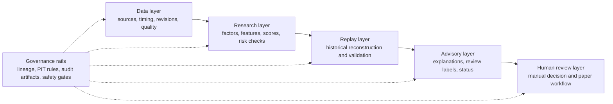

# Investor-Friendly Architecture

## One-sentence explanation

`quant-replay-system` is designed to turn governed market evidence into explainable research and historical validation, then present the result for human review without converting it into an automatic order.

The diagram is a product architecture, not a claim of production readiness. Current capabilities use local/mock and report-only contexts, and no layer grants real buy-review, broker, order, or trading authority.

## 1. Data layer

**Purpose:** Create a trustworthy record of market, universe, corporate-action, source, and evidence context.

**How it creates value:** The layer records when information became usable, which source and revision it came from, and whether it passed quality and eligibility checks. This reduces hindsight leakage and makes later research easier to audit.

**Current foundation:** Local ingestion and snapshot workflows, data-quality and health artifacts, a point-in-time data contract, and report-only source/evidence governance designs.

**Future expansion:** Reviewed production sources, permissions, source-backed lineage, real point-in-time admissibility, structured events, and governed company-exposure data.

## 2. Research layer

**Purpose:** Transform eligible data into interpretable research features, scores, risk checks, and candidate rankings.

**How it creates value:** The project favors named, decomposable score components and an expandable factor ontology, allowing a reviewer to understand why a candidate appeared and where a research idea belongs.

**Current foundation:** Point-in-time factor-dataset construction, technical indicators, explainable scoring, candidate selection, and synthetic/report-only factor-definition governance.

**Future expansion:** Real source-backed factor observations, calibrated models, active-weight and threshold governance, richer event research, and AI-assisted synthesis.

The primary research structure is an eight-layer taxonomy. A fixed 12-factor list is only a coverage checklist and is not the final or closed factor universe.

## 3. Replay layer

**Purpose:** Reconstruct historical research decisions under the information and execution assumptions that applied at the time.

**How it creates value:** A reviewer can see what the system would have selected on a decision date, which inputs were eligible, how the score was formed, and how a later simulated outcome was measured.

**Current foundation:** Single-date replay, batch replay, simulated T+1 handling, reporting, parameter-calibration, portfolio-simulation, and walk-forward validation foundations using local/mock contexts.

**Future expansion:** Real PIT-admissible replay inputs, frozen decision evidence, governed forward labels, stronger out-of-sample studies, and manually reviewed promotion decisions.

Historical replay is a research validation framework. It is not live trading, and simulated trades are not orders.

## 4. Advisory layer

**Purpose:** Convert research artifacts into clear review context for a person.

**How it creates value:** Advisory artifacts can state what to watch, why it appeared, how long the view is valid, what invalidates it, and which source, risk, or data-quality caveats apply.

**Current foundation:** Deterministic advisory semantics, signal reports, local alert previews, single-symbol review, daily review packets, indexes, health checks, and status views.

**Future expansion:** Richer explanation, more natural interaction, carefully governed AI assistance, and separately approved delivery channels.

Advisory labels are review states. They are not validated recommendations, orders, paper approvals, or permission to trade.

## 5. Human review layer

**Purpose:** Keep judgment and authority explicit.

**How it creates value:** A human can review the evidence, reasons, caveats, and workflow health before any paper or future execution-like decision. Review identities, reasons, status transitions, and safety flags are designed to remain auditable.

**Current foundation:** Manual review templates, local paper-workflow components, reconciliation artifacts, dashboard/status context, and mandatory-confirmation fields.

**Future expansion:** Separately governed operating procedures for validated research review. Any later buy-review or execution assistance would require new evidence, approvals, risk controls, and operational review.

The current project has no real buy-review authority and no trading authority. Buy-review, if separately established in the future, would still not equal trading authority.

## Cross-layer governance

Governance is not a sixth downstream step; it is a control rail across every layer:

- source identity, permission, lineage, and revisions;
- `available_time` eligibility and future-leakage guards;
- explicit China A-share and ETF universe/status treatment;
- deterministic reports, metadata, and artifact identifiers;
- health checks, warnings, blockers, and next-manual-action views;
- separation of research, labels, metrics, models, paper workflow, buy-review, and trading authority;
- manual confirmation and negative proof fields such as no broker, no order, and no auto-trading.

## Current foundation and future platform

| Today | Future, after separate evidence and approval gates |
| --- | --- |
| Local/mock and report-only research substrate | Reviewed production data and real PIT-admissible evidence |
| Explainable deterministic scoring foundations | Governed factor observations and calibrated model research |
| Replay and walk-forward workflow foundations | Robust source-backed out-of-sample validation |
| Local advisory and manual review artifacts | Richer AI-assisted research explanation and approved delivery |
| No broker, order, buy-review, or trading authority | Any authority remains a separate future governance decision |

## Repository evidence

- [Product vision](../product_vision.md)
- [Point-in-time data contract](../data_contract.md)
- [Replay run orchestrator](../replay_run_orchestrator.md)
- [Factor definition and taxonomy](../factor_definition_schema_fixture.md)
- [Signal advisory contract](../signal_advisory.md)
- [Unified local research dashboard](../local_research_dashboard.md)
- [Quant research design boundaries](../quant_research_design_pack_v0_1.md)
