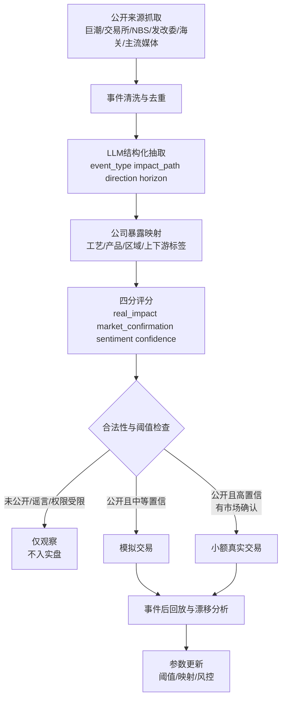

# 中国事件驱动与产业链量化系统的因子分层框架研究

## 执行摘要

结论先行：**此前提出的“8 个一级因素”更适合作为中国主题事件驱动/产业链量化系统的主框架；“12 个因素”更适合作为覆盖性检查清单，而不是直接拿来落库和建模。** 真正进入实现阶段时，二者都还需要补上一层**跨层元数据治理**，至少包括：`source_type`、`legality_flag`、`lag_days`、`confidence`、`mapping_scope`、`coverage`、`revision_risk`。原因很中国化：一方面，国家统计局的官方数据体系很重要，但统计口径、发布时间、修订与反数据造假治理本身就是模型风险的一部分；另一方面，证监会、交易所、发改委等机构对交易、价格形成和信息环境的影响较强，制度与监管不是外生背景，而是因子体系的一部分。citeturn17search1turn17news0turn17news2turn24news1turn24news2turn17news3

从“中国 A 股 + 事件驱动 + 产业链图谱”的目标看，原始 8 层里最有价值的四层是：**公司经营层、行业与产业链层、资本市场制度与供需层、资金行为与交易微观结构层**。这四层分别回答四个不同问题：公司到底会不会多赚或少赚、产业链上哪一环发生了变化、制度和市场供给会不会改变价格弹性、以及资金是否真的在交易这件事。它们在中国不能混成一个“基本面 + 情绪”的粗框架，因为监管层对程序化交易、增值行情数据、市场操纵、虚假信息和资本市场稳定都在持续干预；这些干预本身会改变事件到价格的传导强度。citeturn24news1turn24news2turn22news4turn22news8turn26news0turn26news2

我建议的修订版不是推翻原 8 层，而是**保留 8 个一级层级、重写边界、细化二级因素，并把“合规边界 + 数据可信度”从隐含假设升级为显式元数据**。具体上，应把“公司基本面”和“公司事件”合并进“经营与公司事件层”，把“宏观/政策/国际”拆成可实现的六类二级因子，把“舆情”和“预期差”坚决分开，并把原本较虚的“特殊风险/黑天鹅层”改成更可实施的“风险事件与合规边界层”。这样更利于数据库 schema、因子库、事件库、公司暴露表、信号评分表以及回测引擎的协同。这个判断并非抽象偏好，而是基于公开中国数据环境与监管环境作出的工程化取舍。citeturn17search1turn24news1turn24news2turn26news2turn17news3

对 **¥10k 钢铁 MVP** 来说，最该优先的 10 个高价值因子是：**螺纹钢价格、热卷价格、铁矿石价格、焦煤/焦炭价格、成材—原料价差、粗钢产量约束/限产、钢材出口与贸易政策、地产/基建需求代理、库存去化速度、以及公告类公司事件**。这 10 个因子之所以优先，并不是因为它们“最完美”，而是因为它们在国内最容易用公开数据做出：海关数据能看到钢材出口和铁矿石进口，SHFE/DCE 的公开行情能做价格与价差确认，国家统计局与发改委能提供部分宏观与政策频率锚点，而上市公司公告能补公司层暴露。citeturn22news5turn12news2turn6news1turn6news4turn17search1turn17news3

## 判断标准与总体结论

本报告把“是否适合中国事件驱动/产业链量化系统”拆成五个判断维度：**定义是否清晰、传导链是否闭环、可测二级因子是否足够、数据是否能公开或用代理变量逼近、以及是否适合回测与合规治理**。其中数据可得性按 A–E 评级：**A** 为公开、结构化、频率较高；**B** 为公开但有明显滞后或分散；**C** 为关键变量需靠代理变量拼接；**D** 为核心变量多依赖付费或难稳定抓取；**E** 为非公开、敏感或合规上不应使用。这个评级是工程评级，不是学术真理。  

中国语境下，这个评级不能只看“有没有数据”，还要看**数据是否会被修订、是否存在反欺诈与可信度问题、是否会被政策与市场干预改变价格发现、以及是否存在被限制访问的风险**。这正是为什么“数据质量”和“合法性”必须成为显式元字段：国家统计系统近年专门修法打击统计造假，说明宏观数据的发布权威性很高，但模型仍要显式管理口径、修订与真实性风险；与此同时，监管层对程序化交易、增值行情数据、虚假信息和市场操纵的态度更强硬，意味着“可测”不等于“可稳定用”。citeturn17search1turn17news0turn17news2turn24news1turn24news2turn26news2

综合判断是：**8 层框架是合适的主骨架，12 因素框架是必要但不充分的检查单；二者都需要被重写成“一级因子家族 + 二级因子 + 三级字段 + 跨层治理元数据”的实现形态。** 这是因为中国市场并不是一个可以仅用“宏观—行业—公司”三层解释的市场。市场制度、政策干预、交易微观结构、舆情传播、虚假信息治理和程序化交易监管都实实在在地改变价格路径。2025 年交易所对部分主体的卖出节奏施加口头限制、监管层推动长线资金增配 A 股、并持续强化算法交易和虚假信息治理，都说明制度层和微观结构层必须从“附注”提升到“主层级”。citeturn22news4turn22news8turn22news6turn24news1turn26news2

## 八个一级因素的适配性审查

下表给出此前 8 个一级因素的工程化评估。这里的“定义清晰度”与“适配性”是本报告的建模判断；而中国特有的“陷阱”部分，则尽量用近期公开监管与市场事实来校准。

| 一级因素 | 定义清晰度 | 典型股价传导链 | 典型可测子因子 | 数据可得性 | 代理变量示例 | 中国建模陷阱 | 适配性判断 |
|---|---|---|---|---|---|---|---|
| 公司经营层 | 高 | 收入/成本/毛利/现金流/负债 → 利润预期 → 估值/股价 | 收入增速、订单、原料成本、毛利率、应收、经营现金流、债务到期、回购分红 | B | 存货、应收、合同公告、招投标、上游价格、销量快报 | 财报滞后；订单与利润时滞长；国企目标不等于股东回报 | **必保留** |
| 行业与产业链层 | 高 | 上游资源/中游产量/下游需求/库存/价差 → 行业利润 → 公司映射 | 原料价格、产品价格、价差、开工率、库存、出口、下游需求 | A–B | 期货主力、海关月度进出口、固定资产投资、PMI、价格指数 | 不同行业链条长短差异大；公司暴露映射要靠标签 | **必保留** |
| 宏观/政策/国际层 | 中 | 宏观景气/流动性/政策/关税/汇率/地缘 → 风险偏好与盈利中枢 | PMI、CPI/PPI、社融、LPR、专项债、行业政策、关税、汇率 | A–C | 商品价格、发改委政策节奏、NBS 高频指标、海关数据 | 统计滞后、修订与可信度；政策落地与执行不对称 | **保留但要拆分** |
| 资本市场制度与供需层 | 高 | IPO/再融资/解禁/回购/指数纳入/监管维稳 → 股票供给与资金需求 → 价格弹性 | IPO 节奏、解禁、减持、回购、分红、ETF 申赎、融资融券、基金费率 | B | 解禁日历、指数样本调整、公告、基金份额变动 | 制度变化快；窗口指导难结构化；维稳会扭曲事件定价 | **中国场景下必须独立成层** |
| 资金行为与交易微观结构层 | 高 | 成交/换手/盘口/订单流/程序化行为 → 短期价格路径 | 成交额、换手率、振幅、盘口、龙虎榜、量价背离、波动跃迁 | A–C | 放量突破、异动成交、涨跌停结构、ETF 资金流 | 程序化监管强化；增值 tick 数据可能受限；高频特征可漂移 | **中国场景下必须独立成层** |
| 信息/新闻/舆情层 | 中高 | 公告/部委通告/行业新闻/社媒传播 → 注意力与信息扩散 → 预期更新 | 公告事件、政策标题、讨论量、转载量、传播节点、辟谣 | A–C | 标题分类、搜索热度、社媒量、KOL 节点、媒体级别 | 社媒噪音高；虚假信息和“带节奏”会污染标签 | **保留但与预期差分离** |
| 预期差与估值层 | 中 | 实际结果 vs 市场原预期 → 重估/再定价 | 盈利预期修正、估值分位、事件后漂移、风格拥挤、利好兑现 | B–C | 事件后相对收益、估值 z-score、同行比较、修正方向 | “市场原预期”是隐变量；容易与情绪层混淆 | **必保留** |
| 特殊风险/黑天鹅层 | 中 | 事故/处罚/战争/灾害/停牌/ST → 风险溢价飙升/流动性枯竭 | 安全事故、环保处罚、诉讼、停牌、ST、地缘冲击 | B–D | 应急通报、处罚公告、停牌/ST 标签、油价冲击 | 低频、尾部、样本稀疏；更适合作为触发层与风控层 | **应重命名并重构** |

这张表背后的关键事实是：中国的公开数据体系和市场监管体系都足够强，足以支持事件驱动与产业链建模，但它们的**行政约束、口径时滞与市场干预**也会显著改变因子的稳定性。国家统计局不仅承担宏观统计发布，还运行 National Data；但统计法近年修订恰恰表明，模型不能把官方数据当作无误差真值，而应把“发布时间、修订风险、可信度”纳入元数据。citeturn17search1turn17news0turn17news2

同样地，资本市场制度层和交易微观结构层在中国必须独立出来，而不能塞进“宏观”或“情绪”。近期监管和交易所对量化交易的监督更强，对部分增值数据馈送的可得性也出现不确定性；同时，市场稳定工具、对某些资金净卖出的约束、以及要求长期资金增持 A 股的政策，都说明价格并不只由“基本面新信息”决定。citeturn24news1turn24news2turn22news4turn22news8turn22news6

“特殊风险/黑天鹅层”本身也需要重写。对系统实现来说，真正重要的并不是抽象的“黑天鹅”概念，而是**可被事件触发、可被合规规则拦截、可进入风控和交易限制的风险事件集**，例如停牌/ST、信披违规、重大处罚、环保或安全事故、地缘冲突导致的商品价格急跳。近期中东冲突推动中国 PPI 上行、并触发发改委对成品油价格的制度性调整，就是外部冲击通过政策机制传导到企业成本与利润的典型例子。citeturn22news1turn17news3turn22news0

## 十二因素映射与修订方向

原来的 12 因素覆盖面并不差，问题主要不在“漏项”，而在**重复、边界混乱、技术实现粒度不一致**。下面是逐项映射与建议。

| 原 12 因素 | 对应 8 一级因素 | 重叠/冗余问题 | 建议 |
|---|---|---|---|
| 宏观经济 | 宏观/政策/国际层 | 与货币流动性、财政政策高度重叠 | 保留，但仅作为二级“宏观景气” |
| 货币与流动性 | 宏观/政策/国际层 | 与宏观经济混杂 | 单列为二级“货币与流动性” |
| 财政与产业政策 | 宏观/政策/国际层 | 与行业政策、国际政策边界模糊 | 拆成“财政/地产基建政策”与“产业监管政策” |
| 行业周期 | 行业与产业链层 | 与库存、产能、价格周期混为一谈 | 落到供给、需求、库存、价差四类二级因子 |
| 产业链上下游 | 行业与产业链层 | 与商品/原料价格高度重叠 | 保留，但与“产品价格与价差”合并设计 |
| 公司基本面 | 公司经营层 | 与公司事件耦合过紧 | 保留为“经营质量”二级组 |
| 公司事件 | 公司经营层 + 信息层 | 同时属于基本面触发与信息触发 | 合并进“经营与公司事件层”，并在信息层保留传播侧 |
| 商品/原材料/汇率/利率 | 行业层 + 宏观层 | 商品与汇率/利率不是一个层次 | 拆为“行业价格/价差”和“汇率利率/进口成本” |
| 国际关系/地缘政治 | 宏观层 + 风险层 | 与政策、黑天鹅双重重叠 | 拆为“国际贸易/关税”和“外部冲击风险” |
| 市场结构/交易制度 | 资本市场制度与供需层 | 基本独立，无需并入其他层 | 保留且扩充 |
| 资金行为/算法交易 | 资金行为与交易微观结构层 | 基本独立，但“资金行为”和“算法交易”层次不同 | 算法交易改成二级题目，资金行为保留上级 |
| 舆情/情绪/预期差 | 信息层 + 预期差层 | 传播机制与定价逻辑混在一起 | **必须拆开**：舆情归信息层，预期差归定价层 |

这张映射表说明：**12 因素不是错，而是更像“研究提纲”；8 一级因素更像“系统骨架”。** 如果直接拿 12 因素建数据库，最容易发生三种坏事：第一，宏观、流动性、政策被重复入库；第二，公司事件既放进基本面又放进新闻层，信号会双重计数；第三，舆情与预期差混在一起，导致“热度高 = 利好强”这类伪逻辑。  

最需要补上的“缺失类别”并不是新的市场因素，而是两类**跨层治理维度**。一类是**数据质量与时滞**：发布时间、修订风险、是否存在反欺诈背景、是否需要代理变量、是否存在缺口。另一类是**合规与合法性**：来源是否公开、是否可能触及内幕信息、是否涉及受限数据馈送、是否可能违反数据权限或误导信息治理规则。中国监管过去两年对市场操纵、内幕交易、虚假信息和算法交易的表态都更强硬，这意味着合规元数据不能只放在法务文档里，而要进入信号引擎本身。citeturn26news0turn26news2turn24news2

基于这个判断，修订建议是：**保留 8 个一级层级，但改名、拆边界、显式加入跨层元字段。** 其中最重要的三处修改是：  
其一，把“公司经营层”改成**经营与公司事件层**；  
其二，把“宏观/政策/国际层”改成**宏观流动性与政策国际层**，在二级层明确拆出宏观景气、流动性、财政地产、产业政策、汇率利率、国际贸易与地缘；  
其三，把“特殊风险/黑天鹅层”改成**风险事件与合规边界层**，让它既接住停牌/ST/处罚/事故，也接住数据合法性与内幕边界。

## 面向实现的修订版层级分类

### 修订后的一级结构

我建议的一级结构如下。它保留了“8 层主骨架”，但更适合数据库 schema、因子库和事件图谱实现。

| 修订后一级层 | 设计目的 |
|---|---|
| 经营与公司事件层 | 抽取公司真实经营变化与公司级触发事件 |
| 行业供需与产业链价格层 | 把产业链逻辑拆成供给、需求、库存、价格、价差与竞争 |
| 宏观流动性与政策国际层 | 把宏观景气、货币财政、产业政策和外部冲击放在统一框架 |
| 资本市场制度与供需层 | 捕捉中国特有的制度、供给、被动资金与维稳特征 |
| 交易行为与微观结构层 | 描述量价、盘口、程序化行为、游资与风险出清 |
| 信息披露与舆情传播层 | 管理公告、政策新闻、行业新闻、社媒和谣言传播 |
| 预期、估值与定价偏离层 | 单独处理“市场原预期”与“已定价程度” |
| 风险事件与合规边界层 | 覆盖处罚、停牌、事故、黑天鹅和非法数据隔离 |

### 二级与三级因子字典

下表是面向实现的**一级 → 二级 → 三级字段**建议。为了可读性，我把三级字段写成“字段示例”而不是完整 schema；真正落库时，建议再拆成 `factor_definition`, `factor_observation`, `entity_exposure`, `event_structured`, `source_registry` 五张基表。

| 一级层 | 二级因子 | 三级字段示例 |
|---|---|---|
| 经营与公司事件层 | 收入与订单 | revenue_yoy, order_amount, new_contract_count, top_customer_share |
| 经营与公司事件层 | 成本与原料 | raw_material_cost_index, energy_cost, freight_cost, import_cost |
| 经营与公司事件层 | 毛利与价差 | gross_margin, spread_proxy, product_mix, pass_through_ratio |
| 经营与公司事件层 | 现金流与营运资本 | ocf, receivable_days, inventory_days, prepayment_ratio |
| 经营与公司事件层 | 资产负债与融资 | debt_maturity, leverage, interest_cost, pledge_ratio |
| 经营与公司事件层 | 治理、资本运作与公司事件 | buyback_flag, dividend_yield, mna_flag, executive_change, penalty_flag |
| 行业供需与产业链价格层 | 上游资源供给 | ore_import, mine_disruption, refinery_run_rate, power_supply |
| 行业供需与产业链价格层 | 中游产量与开工 | crude_steel_output, capacity_utilization, maintenance_days |
| 行业供需与产业链价格层 | 下游需求 | property_starts, infrastructure_investment, auto_output |
| 行业供需与产业链价格层 | 库存与去库速度 | social_inventory, mill_inventory, destock_speed |
| 行业供需与产业链价格层 | 产品价格与跨品种价差 | rebar_price, hrc_price, ore_price, spread_hc_rb |
| 行业供需与产业链价格层 | 替代、技术升级与竞争格局 | substitution_rate, tech_upgrade_flag, concentration_change |
| 宏观流动性与政策国际层 | 宏观景气 | pmi, ppi, cpi, industrial_output, fixed_asset_investment |
| 宏观流动性与政策国际层 | 货币与流动性 | lpr, rr_cut_flag, social_financing, interbank_rate |
| 宏观流动性与政策国际层 | 财政与地产基建政策 | local_bond_issuance, property_support_flag, infrastructure_plan |
| 宏观流动性与政策国际层 | 产业政策与监管 | subsidy_flag, capacity_cut_flag, catalog_update |
| 宏观流动性与政策国际层 | 汇率、利率与进口成本 | cny_fx, bond_yield, import_cost_index |
| 宏观流动性与政策国际层 | 国际贸易、关税与地缘 | tariff_flag, antidumping_flag, export_control_flag, geopolitical_risk |
| 资本市场制度与供需层 | IPO 与再融资供给 | ipo_count, ipo_size, secondary_issuance_size |
| 资本市场制度与供需层 | 减持、解禁与回购分红 | unlock_value, insider_sale, buyback_size, dividend_yield |
| 资本市场制度与供需层 | 指数编制、纳入与被动资金 | index_inclusion_flag, etf_flow, rebalance_date |
| 资本市场制度与供需层 | 融资融券与保证金约束 | margin_balance, short_balance, financing_flow |
| 资本市场制度与供需层 | 交易制度规则 | price_limit, t_plus_1_flag, trading_halt_rule |
| 资本市场制度与供需层 | 监管维稳与窗口指导 | market_support_flag, sale_restriction_flag, fee_reform_flag |
| 交易行为与微观结构层 | 成交额、换手与流动性 | turnover, turnover_rate, illiquidity, volatility |
| 交易行为与微观结构层 | 盘口与订单流 | order_imbalance, bid_ask_spread, cancel_ratio |
| 交易行为与微观结构层 | 程序化/高频特征 | abnormal_cancel_flag, microburst_volume, latency_proxy |
| 交易行为与微观结构层 | 龙虎榜/游资强度 | lhb_flag, hot_money_count, seal_rate |
| 交易行为与微观结构层 | 机构/北向/ETF 资金流 | northbound_flow, fund_position_change, etf_subscription |
| 交易行为与微观结构层 | 波动、回撤与风险出清 | drawdown_speed, gap_risk, forced_selling_proxy |
| 信息披露与舆情传播层 | 法定披露事件 | announcement_type, disclosure_time, severity, related_entities |
| 信息披露与舆情传播层 | 政策新闻与部委通告 | ministry, policy_type, effective_date, target_industry |
| 信息披露与舆情传播层 | 行业新闻与价格快讯 | commodity_tag, region, event_type, source_tier |
| 信息披露与舆情传播层 | 社媒讨论与传播路径 | mentions, reposts, influencer_count, cross_platform_spread |
| 信息披露与舆情传播层 | 谣言、辟谣与误导信息 | rumor_flag, refute_flag, misinformation_risk |
| 信息披露与舆情传播层 | 搜索热度与注意力 | search_index, pageviews, media_count |
| 预期、估值与定价偏离层 | 卖方一致预期与修正 | eps_consensus, revision_direction, target_price_change |
| 预期、估值与定价偏离层 | 业绩预告与指引偏差 | guidance_gap, surprise_score |
| 预期、估值与定价偏离层 | 估值水平与分位 | pe_pct, pb_pct, dividend_rank |
| 预期、估值与定价偏离层 | 风格轮动与拥挤度 | style_exposure, crowding_score, factor_overlap |
| 预期、估值与定价偏离层 | 已定价程度 | pre_event_runup, optionless_implied_move_proxy, relative_strength |
| 预期、估值与定价偏离层 | 事件后漂移与反转 | post_event_car_3d, car_5d, reversal_score |
| 风险事件与合规边界层 | 财务异常与信披违规 | restatement_flag, inquiry_letter, accounting_penalty |
| 风险事件与合规边界层 | 停牌、ST 与退市 | stop_trading_flag, st_flag, delist_risk |
| 风险事件与合规边界层 | 安全、环保与生产事故 | accident_flag, env_penalty, plant_shutdown_days |
| 风险事件与合规边界层 | 重大诉讼、税务与处罚 | litigation_amount, tax_penalty, admin_penalty |
| 风险事件与合规边界层 | 黑天鹅 | war_shock, epidemic_flag, disaster_flag |
| 风险事件与合规边界层 | 合规边界 | source_legality, public_timestamp, permission_class, pii_flag |

### 二级因子的源、频率与回测性

下面进一步把每个二级因子映射到数据源、可得性与回测性。这里优先写**中国一手或准一手源**；AkShare/TuShare 一类更适合放在实现层作为聚合适配器，而不是“真源”。

| 二级因子 | 典型数据源 | 数据类型 | 更新频率 | 回测适宜性 |
|---|---|---|---|---|
| 收入与订单 | 巨潮公告、年报、招投标、海关 | 公开+代理 | 季/事件/月 | 中 |
| 成本与原料 | 期货交易所、统计局价格、发改委、海关 | 公开 | 日/周/月 | 高 |
| 毛利与价差 | 交易所价格、公司财报、行业价差 | 公开+代理 | 日/季 | 高 |
| 现金流与营运资本 | 财报、半年报、年报 | 公开 | 季/半年 | 中 |
| 资产负债与融资 | 财报、债券公告、公司公告 | 公开 | 季/事件 | 中 |
| 治理、资本运作与公司事件 | 巨潮、交易所公告 | 公开 | 事件驱动 | 高 |
| 上游资源供给 | 海关、行业新闻、期货、部委通报 | 公开+代理 | 日/月/事件 | 高 |
| 中游产量与开工 | 统计局、协会、行业数据 | 公开+代理/部分付费 | 周/月 | 中高 |
| 下游需求 | 统计局、部委、行业月报 | 公开 | 月 | 中高 |
| 库存与去库速度 | 行业数据、部分协会/钢贸数据 | 代理/部分付费 | 周 | 中高 |
| 产品价格与跨品种价差 | 期货交易所、现货价格体系 | 公开+部分付费 | 日/周 | 高 |
| 替代、技术升级与竞争格局 | 年报、产业政策、行业新闻 | 公开+代理 | 季/事件 | 中 |
| 宏观景气 | 国家统计局 National Data | 公开 | 月/季 | 高 |
| 货币与流动性 | 央行/公开新闻、利率、社融 | 公开 | 日/月 | 高 |
| 财政与地产基建政策 | 发改委、财政部、住建口政策 | 公开 | 事件/月 | 中高 |
| 产业政策与监管 | 发改委、工信部、医保局等 | 公开 | 事件驱动 | 中高 |
| 汇率、利率与进口成本 | 外汇、国债收益率、海关单价 | 公开 | 日/月 | 高 |
| 国际贸易、关税与地缘 | 海关、商务口新闻、国际突发事件 | 公开+代理 | 事件/月 | 中 |
| IPO 与再融资供给 | 交易所、证监会、巨潮 | 公开 | 日/事件 | 高 |
| 减持、解禁与回购分红 | 巨潮、交易所公告 | 公开 | 日/事件 | 高 |
| 指数编制、纳入与被动资金 | 交易所、指数公司、基金公告 | 公开+代理 | 事件/日 | 中高 |
| 融资融券与保证金约束 | 交易所、巨潮、券商摘要 | 公开 | 日 | 高 |
| 交易制度规则 | 证监会、交易所规则 | 公开 | 事件驱动 | 高 |
| 监管维稳与窗口指导 | 证监会、交易所、财经媒体 | 公开+代理 | 事件驱动 | 中 |
| 成交额、换手与流动性 | 交易所行情 | 公开 | 日/分钟 | 高 |
| 盘口与订单流 | Level-2 / 增值行情 | 付费/受限 | 分钟/毫秒 | 中 |
| 程序化/高频特征 | 增值行情、撮合级数据 | 付费/受限 | 高频 | 中低 |
| 龙虎榜/游资强度 | 交易所/市场公开数据 | 公开 | 日 | 中高 |
| 机构/北向/ETF 资金流 | 交易所、基金公告、行情终端 | 公开+代理 | 日 | 中高 |
| 波动、回撤与风险出清 | 行情数据 | 公开 | 日/分钟 | 高 |
| 法定披露事件 | 巨潮、上交所、深交所 | 公开 | 事件驱动 | 高 |
| 政策新闻与部委通告 | 发改委、工信部、国务院系统、证监会 | 公开 | 事件驱动 | 高 |
| 行业新闻与价格快讯 | 主流财经媒体、协会、行业快讯 | 公开+代理 | 日/事件 | 中高 |
| 社媒讨论与传播路径 | 微博、股吧、雪球等 | 代理/平台限制 | 分钟/小时 | 中 |
| 谣言、辟谣与误导信息 | 社媒、公司澄清、监管通报 | 公开+代理 | 事件驱动 | 低中 |
| 搜索热度与注意力 | 搜索指数、媒体计数 | 代理 | 日 | 中 |
| 卖方一致预期与修正 | Wind/iFinD/卖方数据库 | 付费 | 日/周 | 中高 |
| 业绩预告与指引偏差 | 巨潮公告、卖方摘要 | 公开+代理 | 事件 | 高 |
| 估值水平与分位 | 行情 + 财务 | 公开 | 日/季 | 高 |
| 风格轮动与拥挤度 | 指数、因子收益、基金持仓 | 公开+代理/部分付费 | 日/月/季 | 中 |
| 已定价程度 | 事件前涨幅、相对强弱 | 公开 | 日 | 中高 |
| 事件后漂移与反转 | 行情 + 事件库 | 公开 | 日 | 高 |
| 财务异常与信披违规 | 证监会、交易所问询、巨潮 | 公开 | 事件 | 高 |
| 停牌、ST 与退市 | 交易所、公告 | 公开 | 事件 | 高 |
| 安全、环保与生产事故 | 应急、生态环境、地方政府、公告 | 公开 | 事件 | 中高 |
| 重大诉讼、税务与处罚 | 法院公告、税务/监管处罚、巨潮 | 公开 | 事件 | 中高 |
| 黑天鹅 | 新闻、官方应急公告、商品市场 | 公开+代理 | 事件 | 低 |
| 合规边界 | 内部规则库、来源注册表 | 内部治理 | 实时校验 | 不适用 |

这张实现字典的底层逻辑是：**中国的真一手源主要是官方统计、部委公告、交易所/巨潮披露、海关月数据、以及期货与股票交易所行情；代理变量和付费数据主要补“频率”、“颗粒度”和“产业链深度”。** 国家统计局的 National Data 覆盖月度、季度和年度价格与工业统计；海关口径数据能支持钢铁、铁矿石等外贸链条；发改委存在规律性政策机制；监管与交易所规则则决定了制度层与微观结构层的可用边界。与此同时，统计法修订、市场稳定措施与对增值行情的约束，又提醒模型必须记录“revision risk”和“permission class”。citeturn17search1turn17news0turn17news2turn22news5turn17news3turn24news2turn22news4

## 钢铁 ¥10k MVP 的高价值因子与治理设计

### 优先级最高的十个钢铁因子

如果目标是用 **¥10k** 做一个低频、合法、事件驱动的钢铁样板，我建议从修订版 taxonomy 里先抓下面这 10 个因子。它们有两个共同点：一是**公开或准公开可得**，二是**事件到价格的物理链路清楚**。

| 因子 | 所属层级 | 优先理由 | 所需数据/API |
|---|---|---|---|
| 螺纹钢价格变动 | 行业供需与产业链价格层 | 建筑钢利润与情绪最直接锚点 | SHFE/聚合接口 |
| 热卷价格变动 | 行业供需与产业链价格层 | 板材需求与制造业景气锚点 | SHFE/聚合接口 |
| 铁矿石价格变动 | 行业供需与产业链价格层 | 长流程成本核心变量 | DCE/海关/聚合接口 |
| 焦煤/焦炭价格变动 | 行业供需与产业链价格层 | 炼铁成本第二核心变量 | DCE/NBS/聚合接口 |
| 成材—原料价差 | 经营层 + 行业层 | 比单一价格更贴近利润修复 | SHFE+DCE 价差计算 |
| 粗钢产量约束/限产 | 宏观流动性与政策国际层 + 行业层 | 政策事件频率高，方向明晰 | 发改委/部委新闻/事件抽取 |
| 钢材出口与贸易政策 | 行业层 + 宏观层 | 中国钢价和产量预期的重要外部变量 | 海关/贸易新闻/事件抽取 |
| 地产/基建需求代理 | 宏观层 + 行业层 | 长材需求的核心代理 | NBS/发改委/聚合接口 |
| 库存去化速度 | 行业层 | 决定价格弹性和事件兑现速度 | 行业库存数据、部分付费可选 |
| 公司公告类事件 | 经营与公司事件层 | 把行业信号落到个股映射的必需桥梁 | 巨潮/交易所公告 |

这 10 个因子的优先顺序，和钢铁这个行业的公开可观测性直接相关。海关月度数据显示中国铁矿石进口与钢材出口对行情有实质影响；钢材和黑色链期货价格对“压减粗钢产量”“出口摩擦”“需求恢复”这类事件也会作出可观察反应；而一旦事件被市场确认，钢企个股的分化就主要取决于产品结构、工艺路径与公司公告暴露。citeturn22news5turn12news2turn6news1turn6news4turn8news1

### LLM 事件抽取模板与评分体系

对钢铁 MVP，我不建议让 LLM 直接输出“买/卖”。它应先完成**结构化抽取**。最小模板建议如下：

```json
{
  "event_id": "uuid",
  "event_time_public": "2026-05-16T10:30:00+08:00",
  "source_tier": "official|exchange|major_media|industry_media|social",
  "source_name": "NDRC|NBS|CNINFO|SHFE|DCE|Reuters|...",
  "event_type": "capacity_cut|price_shock|trade_policy|company_announcement|accident|inventory_signal",
  "commodity_tags": ["iron_ore", "rebar", "hot_rolled_coil"],
  "region_tags": ["Hebei", "Shandong"],
  "company_candidates": ["600019.SH", "000708.SZ"],
  "impact_path": "cost|price|spread|supply|demand|governance|risk",
  "direction": "positive|negative|mixed",
  "magnitude_hint": "low|medium|high",
  "time_horizon": "1d|3d|5d|20d",
  "legality_flag": "public_confirmed|rumor_only|restricted",
  "confidence_raw": 0.0
}
```

在此基础上，把 `confidence_raw` 进一步拆成四个可解释分数会更稳：

| 分数 | 含义 | 评分建议 |
|---|---|---|
| `real_impact` | 对供需/成本/利润的真实影响 | 0–100，优先看供给、需求、价差是否可量化 |
| `market_confirmation` | 期货/板块/个股是否同步确认 | 0–100，优先看 SHFE/DCE、板块和成交量 |
| `sentiment` | 信息传播热度及方向 | 0–100，但不应主导总分 |
| `confidence` | 源头权威、抽取一致性、映射完整度 | 0–100，含 legality gate |

一个实用的总分可以写成：

```text
signal_score = 0.40 * real_impact
             + 0.30 * market_confirmation
             + 0.10 * sentiment
             + 0.20 * confidence
```

对中国市场，这个配比的核心思想是：**真实影响和市场确认要比舆情热度更重要**。理由很直接：监管层已经明确将打击市场操纵、内幕交易和误导性网络信息，单纯高热度而缺少正式确认的内容，最多只能进入“观察队列”，不应直接触发真金白银信号。citeturn26news0turn26news2

### 事件到信号到决策的流程



### 实盘决策与合规治理

对 **¥10k** 钢铁 MVP，我建议把决策分成三档：

| 决策档 | 条件 |
|---|---|
| 仅观察 | `legality_flag != public_confirmed`，或 `confidence < 55`，或 `market_confirmation < 40` |
| 模拟交易 | `public_confirmed` 且 `confidence >= 55` 且 `real_impact >= 60` |
| 小额真实交易 | `public_confirmed` 且 `confidence >= 70` 且 `real_impact >= 70` 且 `market_confirmation >= 60` |

治理规则则必须写入系统，而不是写在注释里：

| 规则 | 要点 |
|---|---|
| 只用公开时间戳 | 每条事件都记录公开发布时间与抓取时间 |
| 设定来源白名单 | 优先巨潮、交易所、统计局、部委、海关、主流媒体 |
| 谣言默认不进实盘 | 未经公司/部委/交易所确认，一律只观察 |
| 受限数据不接入 MVP | 不依赖受限制的增值 tick 数据与私域消息 |
| 留痕审计 | 保存原文、hash、抽取 JSON、事件版本号 |
| 不自动下单 | MVP 只到“信号与建议”，人工确认后手工委托 |

这些规则不是形式主义。近两年中国监管对内幕交易、市场操纵、误导性信息和算法交易监管都更严；同时，交易所对量化增值行情的边界存在不确定性。因此，把 `legality_flag`、`source_tier`、`permission_class` 做成第一等公民字段，是系统能不能长期用的分水岭。citeturn26news0turn26news2turn24news2turn24news1

## 实施优先级与代码模块

最后给出一版**前 20 项实施优先级**。这些不是“最终产品功能”，而是让体系从概念变成代码所需的最短路径。

| 优先级 | 实施项 | 代码模块 | 主要连接器 | 测试重点 |
|---|---|---|---|---|
| P1 | 来源注册表 | `core/source_registry.py` | 无 | 来源白名单、合法性字段 |
| P1 | 公司主表 | `core/company_master.py` | 巨潮/手工标签 | 主键唯一、证券代码映射 |
| P1 | 钢铁公司暴露标签 | `core/exposure/steel_tags.py` | 年报/公告 | 工艺、产品、区域标签正确性 |
| P1 | 原始事件表 | `core/events/raw_event_store.py` | 公告/新闻 | 去重、时区、抓取时间 |
| P1 | 结构化事件 schema | `core/events/structured_event.py` | 无 | JSON 校验、字段完整性 |
| P1 | 巨潮公告连接器 | `connectors/cninfo.py` | 巨潮 | 时间戳、公告类型识别 |
| P1 | 交易所行情连接器 | `connectors/shfe.py`, `connectors/dce.py` | SHFE/DCE | 交易日历、价格缺失处理 |
| P1 | 统计局连接器 | `connectors/nbs.py` | NBS | 月频数据对齐、修订版本 |
| P1 | 发改委连接器 | `connectors/ndrc.py` | NDRC | 政策事件抽取 |
| P1 | 海关连接器 | `connectors/customs.py` | 海关月度数据 | 月频落地、字段口径 |
| P1 | LLM 提取 Prompt | `llm/prompts/event_extract.py` | 无 | 稳定输出 JSON |
| P1 | LLM 解析器 | `llm/parsers/event_parser.py` | 无 | 解析失败回退 |
| P2 | 事件去重器 | `pipeline/dedup.py` | 无 | 同源与跨源去重 |
| P2 | 行业图谱映射器 | `pipeline/steel_mapper.py` | 无 | commodity→company 暴露映射 |
| P2 | 因子计算器 | `factors/steel_factors.py` | SHFE/DCE/NBS | 价差、库存、需求代理计算 |
| P2 | 市场确认模块 | `signals/market_confirmation.py` | 行情 | futures/stock/volume 确认 |
| P2 | 置信度评分器 | `signals/confidence.py` | 原始事件 | source_tier、交叉确认、合法性 |
| P2 | 信号引擎 | `signals/engine.py` | 上述模块 | score 阈值、观察/模拟/实盘分流 |
| P2 | 回测引擎 | `backtest/event_study.py` | 事件库+行情 | CAR、成本、延迟执行 |
| P2 | 合规防火墙 | `governance/rules.py` | 无 | 非公开数据阻断、谣言仅观察 |
| P3 | 模拟账本 | `sim/paper_ledger.py` | 无 | 持仓、手续费、滑点 |
| P3 | 实盘建议单 | `reporting/trade_note.py` | 无 | 人工确认清单 |
| P3 | 日报/周报 | `reporting/steel_report.py` | 无 | 因子、事件、收益归因 |
| P3 | 单元测试总入口 | `tests/` | 无 | schema、因子、分数、治理规则 |

如果只看“能不能尽快开始”，真正必须先做的其实只有五件事：**事件 schema、公司暴露标签、交易所/统计局/发改委/海关连接器、LLM 结构化抽取，以及信号评分与合规防火墙**。这五件事决定了你的系统到底是“会讲故事”，还是“能形成审计留痕、可回放、可回测、可试单”的研究基础设施。  

从研究结论回到你最初的问题：**原 8 层框架是合适的，但必须工程化重写；原 12 因素框架也有价值，但更适合做检查表而不是数据库主键。** 对中国量化来说，最容易被低估的不是某个技术指标，而是**制度层、微观结构层和合规元数据层**。不把这三部分写进系统，事件驱动/产业链量化很容易在回测里看起来合理，在真实市场里却被政策、噪音、权限或执行边界打断。citeturn24news1turn24news2turn22news4turn22news8turn26news0turn26news2